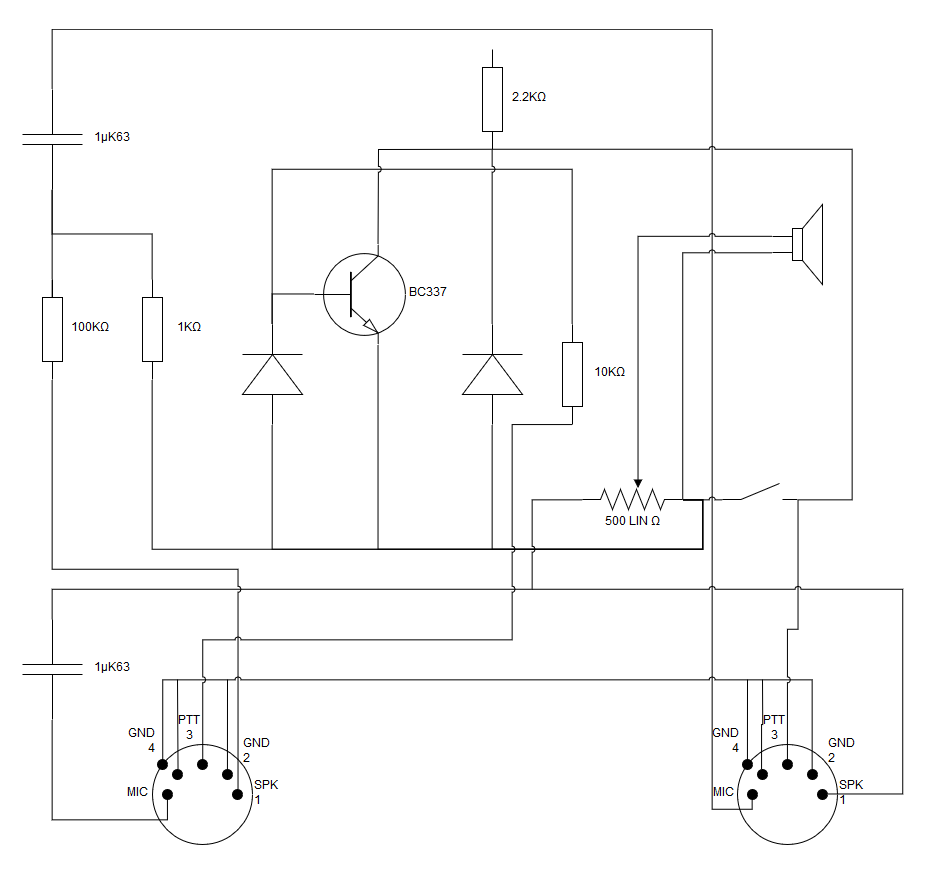
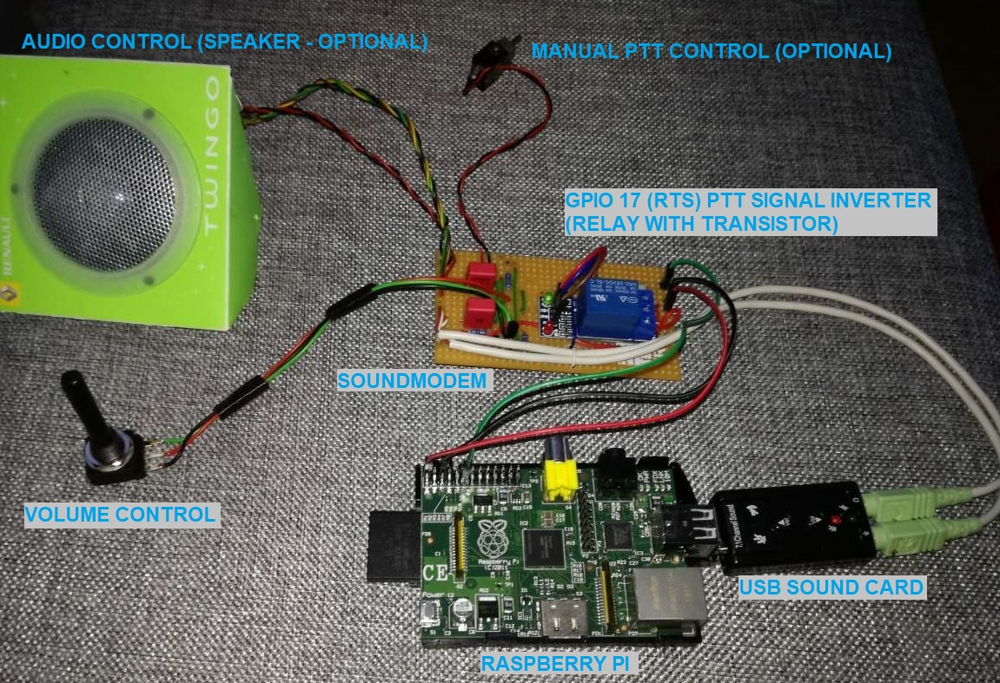
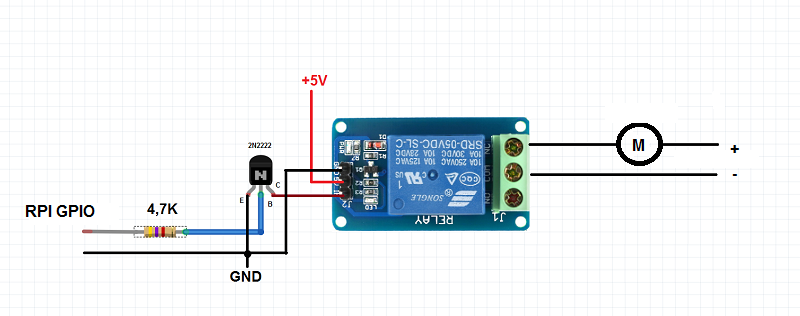
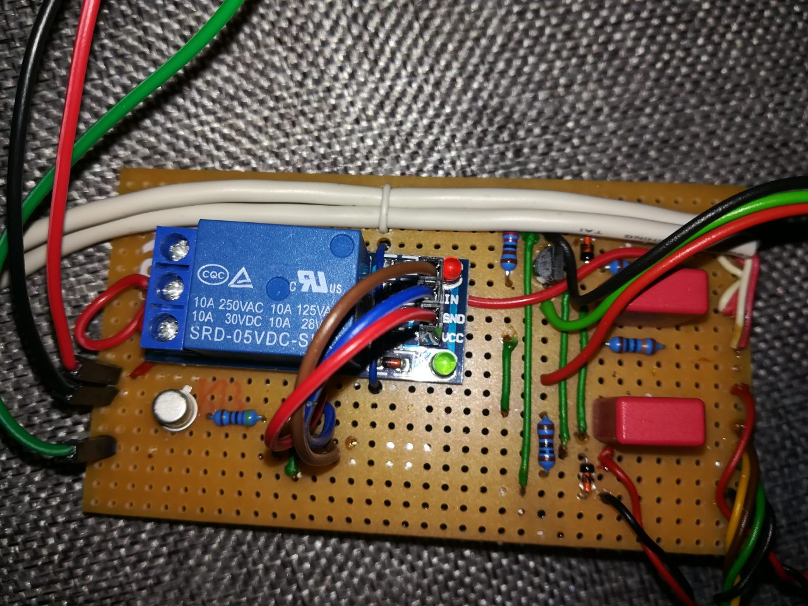
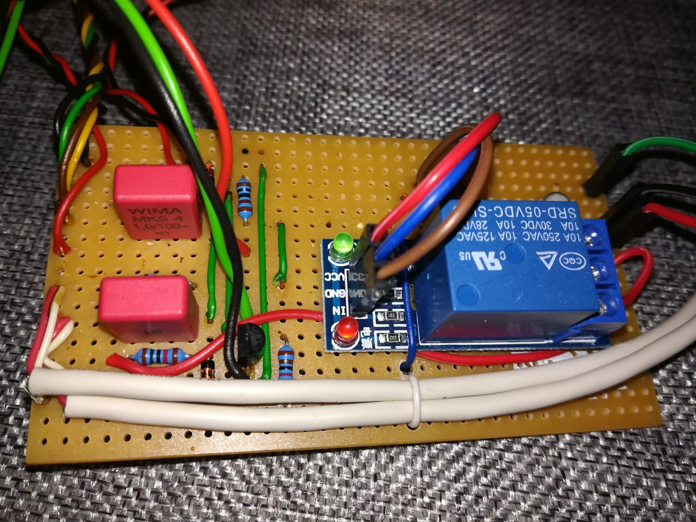
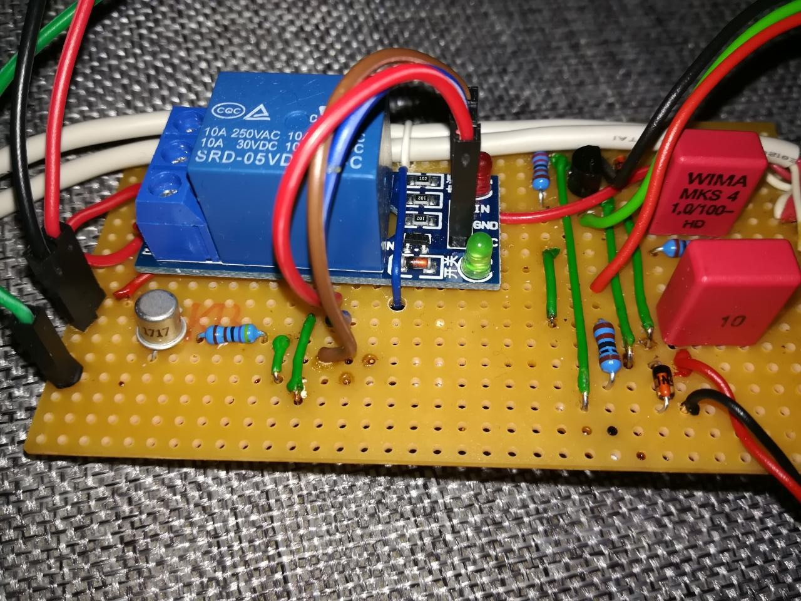

# digipeatux setup guide

digipeatux is a minimalistic embedded Linux system for setting up APRS digipeaters and/or internet gateways, based on [Buildroot](https://buildroot.org/). Although there are numerous possibilities for building and running an APRS digipeater, we have tried to assemble one from relatively cheaply and easily acquirable components, and at the same time to make it's setup process as easy as possible. The resulting Linux system is not really generic, as it's configured to include only the specific software packages needed to work with the chosen hardware components, but then again, a fully generic solution wasn't the design goal either. For that case, generic Linux distributions are already available. This is a highly constrained system that contains the bare minimum needed to accomplish the task of running an APRS digipeater on a specific set of hardware components and nothing else.

The list of needed hardware components are:

- Raspberry Pi board (all models are supported)
- microSD card of at least 512MB capacity
- USB sound card (probably any model but we've tried only a few)
- Amateur radio transmitter
- One-channel relay module with optocoupler 5V 10A
- NPN Transistor TO-92 2N2222
- 5K resistor
- Breadboard (to assemble the components)
- AFSK AX.25 1200 baud soundmodem (or see a below shown schematic on how to assemble one and which components are needed)

The software packages chosen for running the digipeater are:

- [aprx](https://github.com/PhirePhly/aprx)
- [soundmodem](https://archive.org/details/soundmodem-0.20)

## Usage

Before attempting to build an image, make sure that all dependencies of _buildroot_ are met on your host system. To do so, check the section dedicated to the topic in _buildroot_'s [manual](https://buildroot.org/downloads/manual/manual.html#requirement) and install everything listed as mandatory there.

To build an image, clone this repository, and from it's root just execute `make BOARD=<target>`, where `<target>` is one of the following values: `rpi`, `rpi2`, `rpi3`, `rpi0`, e.g.:

```
git clone https://github.com/integricho/digipeatux/
cd digipeatux
make BOARD=rpi2
```

A successful build process should result with an `sdcard.img` file generated in the `build/<target>/images` subdirectory. To burn this image onto an sd card, execute the following command (also adjust the paths according to your case of course):

```
dd if=./build/rpi2/images/sdcard.img of=/dev/mmcblk0 bs=1M
```

Note for Windows users: It is possible to build the image from within WSL as well, but it's not as straightforward as on an actual Linux host, and is also much slower. Burning the sdcard image on the other hand is doable with any of the available utilities, such as [Win32 Disk Imager](https://sourceforge.net/projects/win32diskimager/).

## Hardware setup

- Follow the supplied schematic to assemble a sound modem if you don't have one already.



- Plug in the USB sound card into the Raspberry Pi's USB port.
- The radio transmitter's audio output needs to connect through the sound modem to the USB sound card's input, which receives the audio signal.
- The radio transmitter's microphone input needs to connect through the sound modem to the USB sound card's output, which sends the audio signal.



In order to trigger a retransmission from our side after we receive a message successfully, the radio transmitter must be triggered somehow to switch to the _transmit_ mode. This can be achieved through it's PTT signal interface. The idea is that whenever a transmission needs to start, the software will set the GPIO 17 pin (UART RTS - Ready To Send) on the Raspberry Pi board, and this pin would be connected to the PTT interface, which when receives the signal (RTS ON), will switch to transmission. There are some minor problems with the approach, the first one being that RTS is actually always ON, and switches OFF only during a transmission, and then switches back on at the end of a transmission. For this reason, the signal needs to be inverted, which can be achieved by assembling the following components and installing them between the GPIO 17 pin and the PTT interface:






This helper mechanism needs to be supplied with +5V, so any free +5V pin of the Raspberry Pi and a GND pin can be utilized for it.

The other problem manifested itself by cutting-off the start of every transmission slightly, due to the software starting the transmission immediately after it sets the RTS (GPIO 17) pin. This happened because there is a slight delay while the PTT mechanism toggles the radio transmitter into the _transmit_ mode, but while this was happening the software was already pumping out the audio signal. Luckily this could be easily solved by adding a little artificial delay to the soundmodem configuration (`txdelay` parameter located in `/etc/ax25/soundmodem.conf`):

```xml
...
<chaccess txdelay="450" slottime="100" ppersist="40" fulldup="0" txtail="10"/>
...
```

## Booting the system

When the system boots, follow the on-screen instructions to execute the semi-automated setup process.

```
sudo setup
...
sudo reboot
```

After the setup process is completed and the system is rebooted, the digipeater should be up and running.

## Modifications

The whole root filesystem is mounted as initramfs, so any modifications done during the runtime of the system will be lost when the system is rebooted.

Exceptions to this rule are the paths listed in the file `/etc/persist.conf`. These are essentially config files, which are actually symlinked from a separate partition dedicated for config file storage and is mounted in normal read-write mode.

## Credits

_digipeatux_ came to life from the idea of Süli Dalibor (DL7ORE / YU7ORE). Without his contributions, the project wouldn't have seen the light of day.
